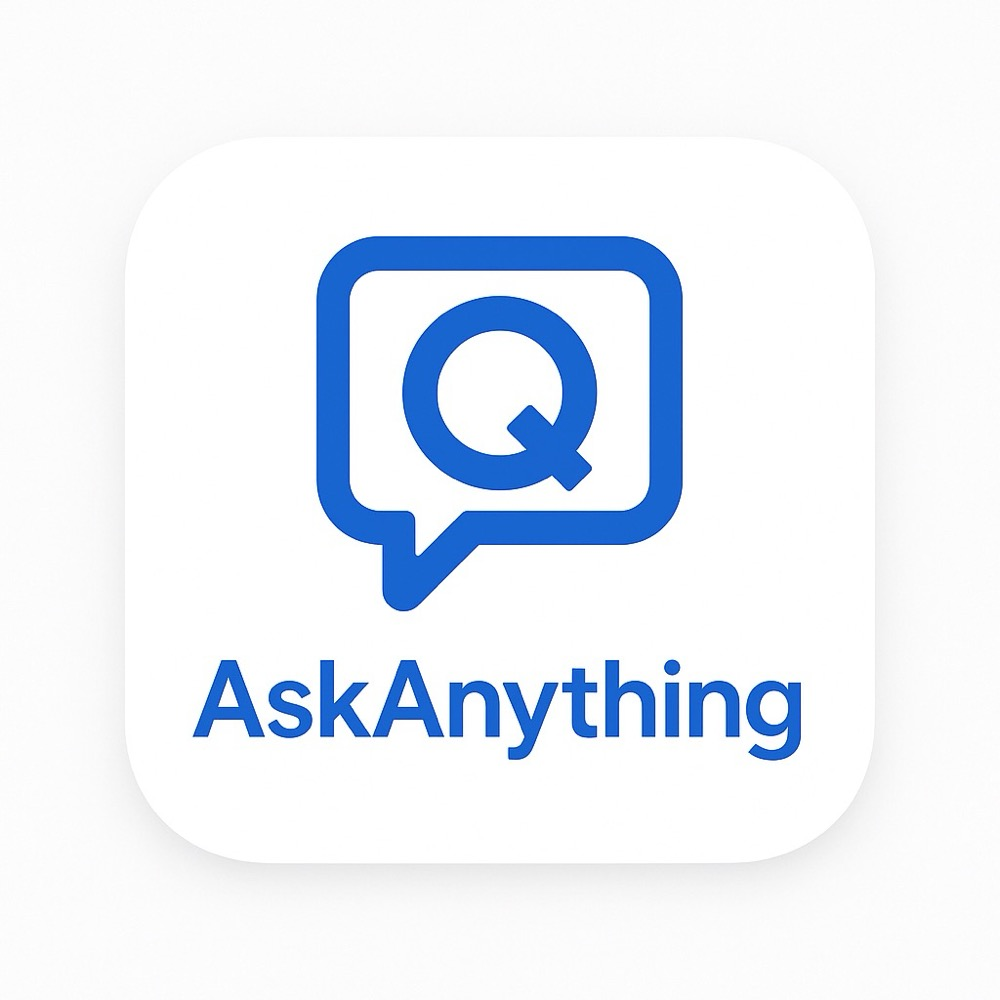

# AskAnything

AskAnything 是一个AI侧边浮标浏览器插件，旨在提供智能化的辅助功能。

<p align="center"></p>

一款Chrome浏览器扩展，提供即时AI问答功能、多模态图片理解和本地Markdown笔记浏览编辑功能，支持多种大语言模型。 **要使用AI功能，你需要自行在扩展的选项页面中配置相应的API密钥。**

## 功能特点

- 🎯 **浮动按钮** - 页面右侧随时可见的浮标，支持拖拽。
- ⚙️ **选项页面** - 用于配置不同AI模型的API密钥和可选的自定义API端点。
- 🧠 **多模型支持** - 支持ChatGPT, Claude, DeepSeek, 通义千问 (需用户自行提供并配置API密钥)。
- 🎭 **多媒体分析** - 支持图片理解和B站视频分析（仅限通义千问模型），提供图片内容描述、视频结构化摘要、章节划分和时间戳跳转。
- 📝 **上下文感知** - 自动获取选中文本或页面信息，并将其包含在发送给AI的请求中。
- 📊 **流式回复** - 实时流式显示AI回答。
- 🧭 **智能工具调用** - 集成网络搜索、图片理解等自定义工具，提供更丰富的AI交互体验。
- 📓 **Markdown笔记** - 内置Markdown笔记编辑器，支持创建、编辑、导入和导出笔记，可与AI对话分屏显示。
- 🔍 **本地历史** - 使用 `chrome.storage.local` 存储最近50条对话历史。
- ⌨️ **快捷键支持** - `Alt+Shift+A` (可修改) 快速访问。
- 📑 **右键菜单** - 选中文本右键询问。

## ⚠️ 重要：API密钥配置

为了使用 AskAnything 的AI问答功能，你**必须**提供你自己账户的大模型和搜索API密钥。本扩展**不会**收集或存储你的密钥到任何远程服务器，密钥仅安全地存储在你本地浏览器的 `chrome.storage.local` 中。

**配置步骤:**

1.  **安装扩展**: 首先按照下面的"本地测试"步骤加载扩展。
2.  **打开选项页面**: 
    *   在Chrome浏览器右上角的扩展程序图标列表中，找到 AskAnything 图标。
    *   右键点击该图标，选择"选项"。
    *   (或者，在浏览器地址栏输入 `chrome://extensions`，找到该扩展，点击"详细信息"，然后选择"扩展程序选项")。
3.  **输入API密钥**: 在选项页面中，为你想使用的AI模型提供商（如 OpenAI, Anthropic 等）输入对应的API密钥。
4.  **(可选) 自定义API端点**: 如果你需要使用代理服务器或者特定区域的API端点，可以在相应的字段中输入。
5.  **保存设置**: 点击保存按钮。

**只有正确配置了API密钥，对应的AI模型才能正常工作。**

## 开发设置

### 前提条件

- Node.js v18+
- npm v8+

### 安装依赖

```bash
npm install
```

### 开发模式

启动开发服务器，代码更改时会自动重新构建。

```bash
npm run dev
```

### 构建扩展

为生产环境构建优化后的扩展。

```bash
npm run build
```

构建的扩展将位于`dist`目录中。

## 本地测试 (加载已解压的扩展)

1.  运行 `npm run build` 生成 `dist` 目录。
2.  打开Chrome浏览器，导航至 `chrome://extensions`。
3.  启用页面右上角的"开发者模式"开关。
4.  点击左上角的"加载已解压的扩展程序"按钮。
5.  选择项目的 `dist` 目录。
6.  **重要**: 扩展加载后，请务必**配置API密钥** (参见上面的"API密钥配置"部分)。

## 如何使用

配置好API密钥后，可以通过以下方式激活 AskAnything 侧边栏：

1.  **点击浮动按钮**: 点击页面右侧的蓝色圆形浮动按钮。
3.  **快捷键**: 使用快捷键 `Alt+Shift+A` (可以在 `chrome://extensions/shortcuts` 中修改)。

打开侧边栏后：
- 在顶部的下拉菜单中选择你想使用的AI模型。
- 在底部的输入框中输入你的问题。
- 按回车或点击发送按钮。
- AI的回答将以流式方式显示在聊天区域。
- 可以点击"停止"按钮中断当前的AI回答。

### 使用多媒体分析功能

当选择**通义千问**模型时，可以使用多媒体分析功能，支持图片理解和B站视频分析：

1. **打开多媒体分析**: 
   - 点击控制栏中的"🎭 多媒体分析"按钮
   - 面板展开后可以看到"📷 图片分析"和"🎬 视频分析"两个标签

2. **图片分析功能**: 
   - 切换到"📷 图片分析"标签
   - 点击上传区域选择图片文件，或直接拖拽图片到上传区域
   - 支持从网页直接拖拽图片（支持大部分网站）
   - 支持 JPG、PNG、GIF、WebP、BMP、SVG 格式，最大10MB
   - 上传后可以输入具体问题，如"这张图片的内容是什么？"
   - 如果不输入问题，系统会默认分析图片内容

3. **视频分析功能**: 
   - 切换到"🎬 视频分析"标签
   - 在输入框中粘贴B站视频链接，支持 bilibili.com 和 b23.tv 等格式
   - 选择分析类型：内容摘要、章节划分、重点时刻或完整分析
   - 可选输入关注关键词，AI会重点分析相关内容
   - 点击"开始分析"按钮启动分析

4. **智能分析**: 
   - 图片：AI会自动调用图片理解工具进行深度分析
   - 视频：自动获取视频标题、描述和字幕信息，生成结构化摘要
   - 支持多轮对话，可以继续询问相关问题

5. **便捷操作**: 
   - 主按钮支持直接拖拽图片进行快速上传
   - 当有图片选择时，按钮会显示📷指示器
   - 可以随时切换标签页进行不同类型的媒体分析

### 使用Markdown笔记功能

1. **打开笔记**: 点击侧边栏顶部的笔记图标，进入笔记模式。
2. **创建笔记**: 在笔记界面可以选择"新建笔记"创建空白笔记。
3. **导入笔记**: 点击"导入笔记"按钮，选择本地的.md文件导入。
4. **编辑笔记**: 
   - 支持纯编辑模式和分屏预览模式
   - 分屏模式下可同时查看渲染效果和编辑内容
5. **导出笔记**: 在查看笔记时，点击"导出"按钮将笔记保存为Markdown文件。
6. **分屏浏览**: 可以同时查看AI对话和笔记内容，还可收起聊天界面专注于笔记。
7. **浏览全部笔记**: 点击"所有笔记"按钮查看和选择已保存的笔记。

## 项目结构

```
├── assets/              # 图标等静态资源
├── dist/                # 构建输出目录
├── docs/                # 项目文档
├── src/
│   ├── content-script.ts  # 内容脚本 (注入浮标, 页面交互)
│   ├── service-worker.ts  # 后台脚本 (事件处理, API调用, 核心逻辑)
│   ├── shared/          # 共享类型和工具 (models.ts, history.ts, settings.ts)
│   ├── sidepanel/       # 侧边栏UI (React, Zustand, components/)
│   └── options/         # 选项页面 (用于配置API密钥等)
├── vite.config.ts       # Vite构建配置
├── manifest.json        # 扩展清单文件
├── package.json         # 项目依赖和脚本
└── ...
```

## MCP集成

请注意，本项目由于是插件，所以只能实现MCP中的SSE和Streamable HTTP协议，故而推荐使用[mcp-proxy](https://github.com/sparfenyuk/mcp-proxy)作为使用stdio协议的MCP srever代理，具体使用方法请参考其项目。

## 🆕 最近更新

### v1.2.1 - 多媒体分析功能融合
- 🎭 **统一界面**: 将图片上传和视频分析功能融合到一个"多媒体分析"按钮中
- 📑 **标签切换**: 通过标签页在图片分析和视频分析之间快速切换
- 🎨 **优化体验**: 统一的设计语言，更直观的操作流程
- 🚀 **快捷操作**: 主按钮支持直接拖拽图片，提供状态指示器
- 💾 **节省空间**: 减少界面元素，提供更简洁的用户体验

### v1.2.0 - B站视频分析功能
- 🎬 **B站视频分析**: 新增B站视频内容智能分析功能，支持多种分析模式
- 📊 **结构化输出**: 提供内容摘要、章节划分、重点时刻等多种分析类型
- ⏰ **时间戳导航**: 生成可点击的时间戳跳转链接，方便定位视频内容
- 🔍 **关键词聚焦**: 支持指定关注关键词，AI会重点分析相关内容
- 🎯 **智能提取**: 自动获取视频标题、描述和字幕信息进行综合分析
- 🔧 **仅限通义千问**: 目前视频分析功能仅在选择Qwen3模型时可用

### v1.1.0 - 多模态图片理解功能
- ✨ **图片上传支持**: 新增胶囊按钮样式的图片上传组件，支持点击和拖拽上传
- 🌐 **网页图片拖拽**: 支持直接从网页拖拽图片到插件中，无需先保存到本地
- 🖼️ **智能图片分析**: 集成阿里云DashScope VLM API，实现图片内容的深度理解和分析
- 🔄 **多轮对话**: 支持图片分析后的连续对话，AI能够引用和对比之前分析的图片
- 🎨 **优化用户体验**: 图片预览、状态管理、错误处理等全面优化
- 📱 **响应式设计**: 适配深色/浅色主题，保持界面一致性
- 🔧 **仅限通义千问**: 目前图片理解功能仅在选择Qwen3模型时可用

## 📚 详细文档

更详细的关于项目架构、各个组件（Content Script, Service Worker, Sidepanel）以及共享模块的说明，请参阅 [./docs/index.md](./docs/index.md) 目录下的文档。

## 🚀 未来计划

我致力于持续改进 AskAnything 并为其添加更多强大的功能。以下是我未来的一些开发计划：

-   **增强搜索工具**: 
    -   集成效果更好、更智能的本地或在线搜索工具，以提供更精准的上下文信息和答案来源。（**重要**）
    -   实现深度研究功能，方便在学习某一内容之前使用本插件做一次综述。
-   **扩展多模态能力**: 
    -   支持更多模型的图片理解功能（目前仅支持通义千问）
    -   ✅ 添加视频内容理解和分析（**已完成 - B站视频分析**）
    -   支持音频文件的转录和分析
    -   添加YouTube视频分析支持
-   **高级笔记记录**: 
    -   开发更详细和结构化的笔记记录功能，允许用户方便地保存、组织和回顾与AI的讨论内容或从网页中提取的关键信息。
    -   支持本地知识库。
-   **智能工作流**: 
    -   添加更多自定义工具和API集成
    -   支持复杂的多步骤任务自动化
    -   实现个性化的AI助手配置
    -   实现浏览器操作功能（不确定）

欢迎社区的建议和贡献，如果您对未来的功能有任何想法，请告诉我！

## 🤝 参与贡献

欢迎各种形式的贡献！如果您有任何想法、建议或发现bug，请随时提出Issue或提交Pull Request。

## 许可证

MIT 